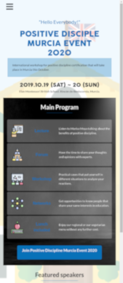

## Week 4

# HTML & CSS capstone project: Conference page

> This Project consists of creating an event page. 

I have selected a Positive Discipline education event taking place in Murcia (Spain) in 2020.

You can find the original project specification at: 

Design idea by 
Icons designed for  from 

## Built With

- HTML
- CSS
- VScode
- Bootstrap

## Live Demo 

[Live Demo Link](https://zappat0n.github.io/education2020/)

## Authors

👤 **Angel Barros**

- GitHub: [@Zappat0n](https://github.com/Zappat0n)
- LinkedIn: [LinkedIn](https://www.linkedin.com/in/angel-luis-barros-pazos-8889011b5/)

## 🤝 Contributing

Contributions, issues, and feature requests are welcome!

## Show your support

Give a ⭐️ if you like this project!

